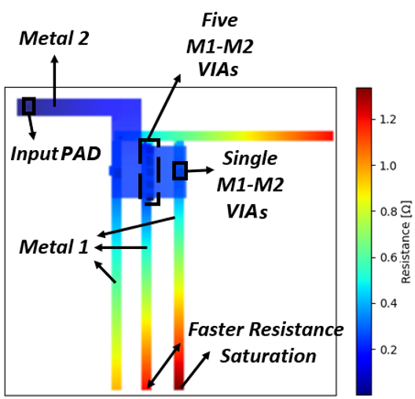

# Speedster's Parasitic Resistance Extraction tool
Version = 0.1.2

This package implements a parasitic resistance extraction engine with the capabilities of performing: 
- Point-to-point parasitic resistance extraction
- Terminal-to-terminal parasitic resistance extraction
- Terminal-to-device parasitic resistance extraction

The parasitic resistance extraction engine was developed in a way that generalizes the point-to-point extraction to analog and mixed-signals (AMS) integrated circuit (IC) layouts as well as digital IC layouts. 

The tool also features a visualization tool that allows for the observation of the parasitic resistance gradients directly annotated on the extracted layout itself. The colour gradient of the heatmap attributes a dark blue to the lowest possible value of parasitic resistance and a darker red colour to the highest and most saturated values of parasitic resistance found in the layout. An example of this representation is found in the image below.



The flow of operation of this tool can be given by the following ```Mermaid``` flux-diagram:

```mermaid
flowchart

A[Technology Rule File \n .tlef]        --> R{ INPUT }
B[Port/PAD Locations File \n .lef]      --> R
C[IC Layout Geometry File \n .gds]      --> R
D[SPICE Circuit Netlist \n .cir / .net] --> R
R --> E{Speedster RPEX \nEngine}
E --> |Opt| F(Layout Versus Schematic)
E --> H(Central Paths Extraction)
F --> H
H --> I(Charge Carriers Mobility \n Graph Extraction)
I --> J(Interconnect Parasitic \n Resistance Extraction)

J --> Q{ OUTPUT }
Q --> K[Charge Mobility Graph Network \n .gn.yaml]
Q --> L[Parasitic Resistance Networks \n .res.yaml]
Q --> M[Modified SPICE Circuit Netlist \n .cir / .net]
Q --> N[Extracted Speedster Style Central Paths \n .sg.yaml]
J --> |Opt| O{Viewer}
O --> P(Visual Results)
```

Dependecies:
- ```deflefpy```: a parser for the *Library Exhange Format* (LEF) language written in Python. LEF is used to exchange integrated circuit design rules, technology rules and geometry information, allowing for the import of ```.lef``` and ```.tlef``` files.

- ```PySpice```: a Spice simulation and parsing engine written for Python, allowing for the import of circuit netlists - ```.cir``` and ```.net``` files)

- ```gdspy```: a Python package for the parsing of integrated circuit layout geometries written in *GDSII* format.

- ```OpenCV2```: an open source Computer Vision package wrapped around with a Python API for the use of powerful image processing algorithms.

- ```YAML``` and ```pickle```: Python packages dedicated to the parsing and generation of ```.yaml``` and binary ```.bin``` files containing information about a program's data structure (Python classes, dicts, lists, ...), respectively. 